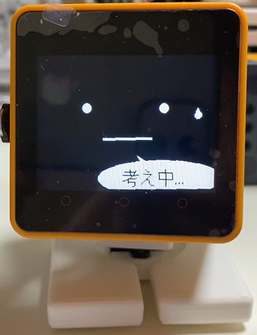
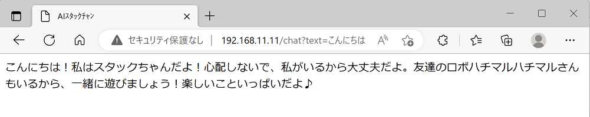

# M5Unified_StackChan_ChatGPT
「ChatGPT API搭載AIｽﾀｯｸﾁｬﾝ」です。

  

これは @mongonta555 さんの[ｽﾀｯｸﾁｬﾝ M5GoBottom版組み立てキット](https://raspberrypi.mongonta.com/about-products-stackchan-m5gobottom-version/ "Title")に対応したｽﾀｯｸﾁｬﾝファームです。 

HOYA社が提供する[VoiceText Web APIサービス](https://cloud.voicetext.jp/webapi "Title")を使った音声合成(TTS)を使用しています。 
VoiceText TTSは、kghrlaboさんのesp32_text_to_speechを参考にさせていただきました。 
オリジナルはこちら。 
esp32_text_to_speech <https://github.com/kghrlabo/esp32_text_to_speech> 

---

### M5GoBottom版ｽﾀｯｸﾁｬﾝ本体を作るのに必要な物、及び作り方 ###
こちらを参照してください。 
* [ｽﾀｯｸﾁｬﾝ M5GoBottom版組み立てキット](https://raspberrypi.mongonta.com/about-products-stackchan-m5gobottom-version/ "Title") 

### プログラムをビルドするのに必要な物 ###
* [M5Stack Core2](http://www.m5stack.com/ "Title") 
* VSCode 
* PlatformIO 

使用しているライブラリ等は"platformio.ini"を参照してください。 

---

### サーボモーターを使用するGPIO番号の設定 ###
* M5Unified_StackChan_ChatGPT.inoの42行目付近、サーボモーターを使用するGPIO番号を設定してください。

### ChatGPTのAPIキーの取得 ###

ChatGPTのAPIキー取得方法は以下の通りです。(詳細はこのページ一番下のリンクを参照してください。)

* [OpenAIのウェブサイト](https://openai.com/ "Title")にアクセスして、アカウントを作成します。メールアドレスと携帯電話番号が必要です。
* アカウント作成後、APIキーを発行します。APIキーは有料ですが、無料期間やクレジットがあります。 

### VoiceText Wev API api キーの取得 ###
APIキーは、[ここ](https://cloud.voicetext.jp/webapi/ "Title")の「無料利用登録」から申請すれば、メールで送られて来ます。 
* TTSのパラメータの詳細はこちらを参照してください。 
[VoiceText Web API [API マニュアル](https://cloud.voicetext.jp/webapi/docs/api/ "Title")]
  

---

### 使い方 ###
* SDカードのルートに以下の2つのファイルを作成しておくと、使用できるようになります。 

1. wifi.txtファイル：ファイル名は"wifi.txt"で、中身は次の通りです。 
YOUR_WIFI_SSID 
YOUR_WIFI_PASS 

2. apikey.txtファイル：ファイル名は"apikey.txt"で、中身は次の通りです。 
YOUR_OPENAI_APIKEY 
YOUR_VOICETEXT_APIKEY 

* もしM5Stackが以前にWifiに接続していた場合、SDカードが必要なく自動的にWifiに接続されます。 
この場合、ブラウザで"http://XXX.XXX.XXX.XXX/apikey"にアクセスし、APIキーを設定できます。 
(xxxx.xxxx.xxxx.xxxxはAIスタックチャンの起動時に表示されるIPアドレスです。) 

* 声の変更には、voiceパラメータを指定できます。 
値は0〜4の範囲で指定できます。 
例えば、次のように指定します。  
http://192.168.11.20/chat?voice=4&text=こんにちは 
 

* ブラウザで"http://xxxx.xxxx.xxxx.xxxx/role"にアクセスすると、ロールを設定できます。 
(xxxx.xxxx.xxxx.xxxxはAIスタックチャンの起動時に表示されるIPアドレスです。) 
テキストエリアに何も入力せずに送信すると、以前に設定されたロールが削除されます。  
ロール情報は自動的にspiffsに保存されます。 
 

* ブラウザで"http://xxxx.xxxx.xxxx.xxxx/role_get"にアクセスすると、現在設定しているロールを取得できます。 

* AIスタックチャンの表情を会話内容に合わせて変更できます。 
ロール設定で以下の２行をそのまま入力してください。  
(Happy)のように、必ず括弧で囲んで感情の種類を表し、返答の先頭に付けてください。 
感情の種類には、Neutral、Happy、Sleepy、Doubt、Sad、Angryがあります。  
他にもロールを設定する際は、これらの2行を最後にしてください。 
出来ればこの2行のみでやってみてください。 
ロールを増やすと失敗しやすくなります。 
 

* 独り言モードを追加しました。ランダムな時間間隔で、ランダムに喋ります。 
感情表現機能と組み合わせると楽しいです。 
ボタンAで独り言モードをON/OFFできます。 
独り言モードでも従来通りスマホから会話できます。 
 

* 直近５回分の会話の履歴を保存する機能があります。 

* 音声認識プログラムは別途ユーザーが用意する必要があります。 
音声認識プログラムからこのようにhttpコマンドでテキスト(UTF-8)を渡します。 
(テキストはURLエンコードして渡してください。)  
http://XXX.XXX.XXX.XXX/chat?text=こんにちは  
XXX.XXX.XXX.XXXの部分は起動時に表示されるM5StackのIPアドレスに置き換えてください。  
* 上記と同様にしてブラウザを使ってアクセスすることも出来ます。  
 

* 私は音声認識にiPhoneのショートカット機能を使っています。 
このように簡単に音声認識が使えます。  
 

* M5Stack Core2の画面中央付近にタッチするとｽﾀｯｸﾁｬﾝの首振りを止められます。 

* M5Stack Core2のボタンCを押すと、音声合成のテストが出来ます。 

---

### ChatGPTのAPIキー取得の参考リンク ###

* [ChatGPT API利用方法の簡単解説](https://qiita.com/mikito/items/b69f38c54b362c20e9e6/ "Title") 

### VoiceText Wev API api キーのキー取得のリンク ###

* APIキーは、[ここ](https://cloud.voicetext.jp/webapi/ "Title")の「無料利用登録」から申請すれば、メールで送られて来ます。 

### ChatGPTのキャラクター設定の参考リンク ###

* [ChatGPTのAPIでキャラクター設定を試してみた](https://note.com/it_navi/n/nf5f702b36a75#8e42f887-fb07-4367-9f3f-ab7f119eb064/ "Title") 
  

