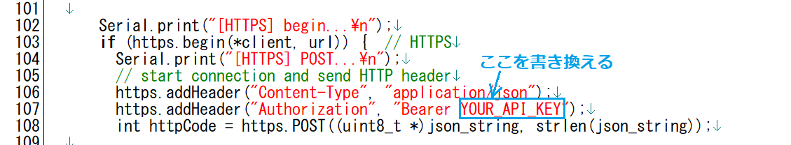

# M5Unified_StackChan_ChatGPT
「ChatGPT API搭載AIｽﾀｯｸﾁｬﾝ」です。

  

これは @mongonta555 さんの[ｽﾀｯｸﾁｬﾝ M5GoBottom版組み立てキット](https://raspberrypi.mongonta.com/about-products-stackchan-m5gobottom-version/ "Title")に対応したｽﾀｯｸﾁｬﾝファームです。 

HOYA社が提供する[VoiceText Web APIサービス](https://cloud.voicetext.jp/webapi "Title")を使った音声合成(TTS)を使用しています。 
VoiceText TTSは、kghrlaboさんのesp32_text_to_speechを参考にさせていただきました。 
オリジナルはこちら。 
esp32_text_to_speech <https://github.com/kghrlabo/esp32_text_to_speech> 

---

### M5GoBottom版ｽﾀｯｸﾁｬﾝ本体を作るのに必要な物、及び作り方 ###
こちらを参照してください。 
* [ｽﾀｯｸﾁｬﾝ M5GoBottom版組み立てキット](https://raspberrypi.mongonta.com/about-products-stackchan-m5gobottom-version/ "Title") 

### プログラムをビルドするのに必要な物 ###
* [M5Stack Core2](http://www.m5stack.com/ "Title") 
* VSCode 
* PlatformIO 

使用しているライブラリ等は"platformio.ini"を参照してください。 

---

### WiFiの設定 ###
* M5Unified_StackChan_ChatGPT.inoの18行目付近、SSIDとPASSWORDを設定してください。

### サーボモーターを使用するGPIO番号の設定 ###
* M5Unified_StackChan_ChatGPT.inoの26行目付近、サーボモーターを使用するGPIO番号を設定してください。

### ChatGPTのAPIキーの設定 ###

ChatGPTのAPIキー取得方法は以下の通りです。(詳細はこのページ一番下のリンクを参照してください。)

* [OpenAIのウェブサイト](https://openai.com/ "Title")にアクセスして、アカウントを作成します。メールアドレスと携帯電話番号が必要です。
* アカウント作成後、APIキーを発行します。APIキーは有料ですが、無料期間やクレジットがあります。
* APIキーを取得したら、M5Unified_StackChan_ChatGPT.inoの107行目付近、YOUR_API_KEYを設定してください。 
  

### VoiceText Wev API api キーの設定 ###
* AudioFileSourceVoiceTextStream.cppの30行目付近、YOUR_TSS_API_KEYを設定してください。 
APIキーは、[ここ](https://cloud.voicetext.jp/webapi/ "Title")の「無料利用登録」から申請すれば、メールで送られて来ます。 
* TTSのパラメータの詳細はこちらを参照してください。 
[VoiceText Web API [API マニュアル](https://cloud.voicetext.jp/webapi/docs/api/ "Title")]
  

---

### 使い方 ###

* 音声認識プログラムは別途ユーザーが用意する必要があります。 
音声認識プログラムからこのようにhttpコマンドでテキスト(UTF-8)を渡します。 
(テキストはURLエンコードして渡してください。)  
http://XXX.XXX.XXX.XXX/chat?text=こんにちは  
XXX.XXX.XXX.XXXの部分は起動時に表示されるM5StackのIPアドレスに置き換えてください。  
* 上記と同様にしてブラウザを使ってアクセスすることも出来ます。  
 

* 私は音声認識にiPhoneのショートカット機能を使っています。 
このように簡単に音声認識が使えます。  
 

* M5Unified_StackChan_ChatGPT.inoの181行目付近、を修正するとAIのキャラクターを設定出来ます。 

* M5Stack Core2の画面中央付近にタッチするとｽﾀｯｸﾁｬﾝの首振りを止められます。 

* M5Stack Core2のボタンCを押すと、音声合成のテストが出来ます。 

* 【注意】会話の履歴を保存する機能はありません。

---

### ChatGPTのAPIキー取得の参考リンク ###

* [ChatGPT API利用方法の簡単解説](https://qiita.com/mikito/items/b69f38c54b362c20e9e6/ "Title") 

### ChatGPTのキャラクター設定の参考リンク ###

* [ChatGPTのAPIでキャラクター設定を試してみた](https://note.com/it_navi/n/nf5f702b36a75#8e42f887-fb07-4367-9f3f-ab7f119eb064/ "Title") 
  
